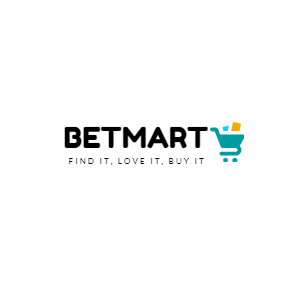

# BETMart
Basic e-commerce shopping website

<h1 align="center">
	
</h1>

<strong>Find It. Love It. Buty It.</strong>

	
	
	
	
	
	

	<a href="https://betmart.azurewebsites.net">Try Online</a> ∙

* Email john.doe@abc.com (P@$$w0rd!)

BETMart is a free, open source, e-commerce shopping cart that allows customers to buy products online. It is web standards compliant and incorporates the newest Microsoft web technology stack.

## Highlights

### Technology & Design

* State of the art architecture developed using `ASP.NET Core 5.0` and `Entity Framework Core`.
* Multi N-Tier Layered architecture
* Easy to extend and extremely flexible modular design
* High scalability
* Developed using SOLID principles and practises
* Highly available deployed to Microsoft Azure Cloud using App Services (99.9% uptime) 
* Easy shop management thanks to modern and clean UI

## How to install

* Clone the repository or download the latest stable release from the download tab and unzip it to your web folder
* Fire it up in Visual Studio
* Change connection strings in the BETMart.API project `appSettings.json` file to your local databaes instance.
* Run Nuget Package Restore
* Build the Project
* Setup startup projects as BETMart and BETMart.API.
* Run solution
* Enjoy ;-)

### System requirements

* Visual Studio 2019 
* ASP.NET SDK 5.0.203 ([Download](https://dotnet.microsoft.com/download/dotnet/5.0))
* MS SQL Server 2014 Express (or higher)
